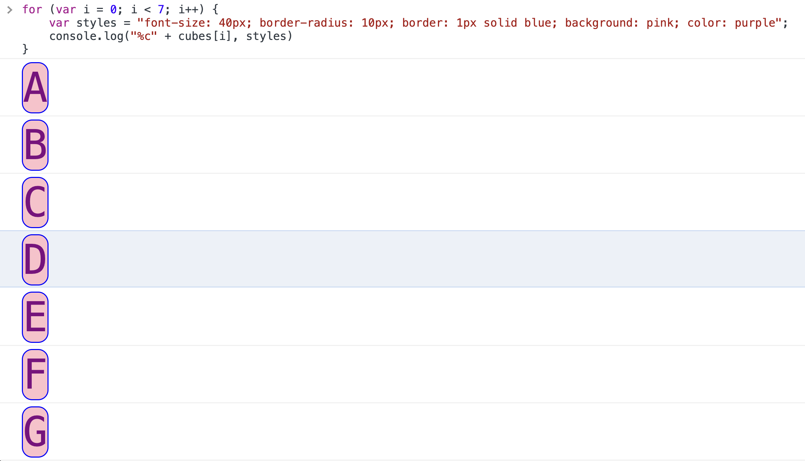

## Operators in depth

In this reading, you will learn about additional operators, operator precedence and operator associativity. I'll also provide you with some examples of logical operators.

### 1. Additional operators

- Logical AND operator: && 

- Logical OR operator: || 

- Logical NOT operator: ! 

- The modulus operator: % 

- The equality operator: ==

- The strict equality operator: ===

- The inequality operator: !=

- The strict inequality operator: !==

- The addition assignment operator: += 

- The concatenation assignment operator: += (it's the same as the previous one - more on that later)

#### The logical AND operator in JavaScript: &&
The **logical AND operator** is, for example, used to confirm if multiple comparisons will return true.

In JavaScript, this operator consists of two ampersand symbols together: `&&`.

Let's say you're tasked with coming up with some code that will check if the currentTime variable is between `9 a.m.` and `5 p.m.` The code needs to console.log `true` if `currentTime > 9` **and** if `currentTime < 17`.

Here's a solution: 
```js
var currentTime = 10;
console.log(currentTime > 9 && currentTime < 17);
```
How does this code work?

First, on line one, I set the `currentTime` variable, and assign the value of `10` to it.

Next, on line two I console log two comparisons: 

`currentTime > 9`

`currentTime < 17`

I also use the `&&` logical operator to join the two comparisons.

Effectively, my code is interpretted as the following:

```js
console.log(10 > 9 && 10 < 17);
```
The comparison of `10 > 9` will return `true`.

Also, the comparison of `10 < 17` will return `true`.

This means I can further re-write the line two of my solution as follows: 
```js
console.log(true && true);
```
In essence, this is how my code works.

Now, the question is, what will be the result of `console.log(true && true)`?

To understand the answer, you need to know the behavior of the `&&` logical operator.

The `&&` logical operator returns a single value: the boolean `true` or `false`, based on the following rules: 

It returns `true` if both the values on its right and on its left are evaluated to `true` 

It returns `false` in all the other instances

In other words: 

`console.log(true && true)` will output: `true`

`console.log(true && false)` will output: `false`

`console.log(false && true)` will output: `false`

`console.log(false && false)` will output: `false`

#### The logical OR operator in JavaScript: `||`
The logical OR operator in JavaScript consists of two pipe symbols together: `||`.

It is used when you want to check if at least one of the given comparisons evaluates to `true`.

Consider the following task: You need to write a program in JavaScript which will return `true` if the value of the `currentTime` variable is not between `9` and `17`. Put differently, your code needs to console.log `true` if the value of the variable `currentTime` is either less than `9` or greater than `17`.

Here's a solution: 
```js
var currentTime = 7;
console.log(currentTime < 9 || currentTime > 17);
```
In line one of the code I assign the number `7` to the variable `currentTime`.

On line two, I console log the result of checking if either `currentTime < 9` or `currentTime > 17` will evaluate to `true`.

It's the same as this: 
```js
var currentTime = 7;
console.log(true || false);
```
Here are the rules of how the `||` operator evaluates given values: 

`console.log(true || true)` will output: `true` 

`console.log(true || false)` will output: true  

`console.log(false || true)` will output: true  

`console.log(false || false)` will output: false

The logical OR operator will always return `true`, except when both sides evaluate to `false`. In other words, for the logical OR operator to return `false`, the results of both comparisons **must** return false.

Going back to the example of checking if either `currentTime < 9` or `currentTime > 17`, this makes sense: the only time you will get `false` is when the value stored in the `currentTime` variable is greater than `9` and less then `17`.

#### The logical NOT operator: `!`
In JavaScript, the logical NOT operator's symbol is the exclamation mark: `!`.

You can think of the ! operator as a switch, which flips the evaluated boolean value from `true` to `false` and from `false` to `true`.

For example if I assign the boolean value of `true` to the `petHungry` variable: 

`var petHungry = true;`

...then I can console log the fact that the pet is no longer hungry by using the ! operator to flip the boolean value stored inside of the `petHungry` variable, like so:

`console.log('Feeding the pet');`

`console.log("Pet is hungry: ", !petHungry);`

`console.log(petHungry);`

This is the output of the above code:

```js
Pet is hungry: true
Feeding the pet
Pet is hungry: false
true
```
The reason for the changed output in the console is because you have flipped the value stored inside the `petHungry` variable, from `true` to `false`.

Notice, however, that the code on line five of the example above still outputs `true` - that's due to the fact that I didn't reassign the value of the `petHungry` variable.

Here's how I could permanently change the value stored in the `petHungry` variable from `true` to `false`: 

```js
var petHungry = true;
petHungry = !petHungry;
```
In this example, I first assign the value of `true` to the new variable of `petHungry`. Then, on line two, I assign the opposite value, the `!true` - read: not true - to the existing `petHungry` variable.

#### The modulus operator: `%`
The modulus operator is another mathematical operator in JavaScript. It returns the remainder of division.

To demonstrate how it works, imagine that a small restaurant that has 4 chairs per table, and a total of 5 tables, suddenly receives 22 guests.

How many guests will not be able to sit down in the restaurant?

You can use the modulus operator to solve this.
```js
console.log(22 % 5); // 2
```
The output is **2**, meaning, when I divide **22** and **5**, I get a **4**, and the remainder is **2**, meaning, there are **2** people who couldn't get a place in this restaurant.

#### The equality operator, `==`
The equality operator checks if two values are equal.

For example, this comparison returns `true`: `5 == 5`. Indeed, it is true that 5 is equal to 5.

Here's an example of the equality operator returning `false`:  `5 == 6`. Indeed, it is true that 5 is not equal to 6.

Additionally, even if one of the compared values is of the number type, and the other is of the string type, the returned value is still `true`: `5 == "5"`. 

This means that the equality operator compares only the values, but not the types.

#### The strict equality operator, `===`
The strict equality operator compares for both the values and the data types.

With the strict equality operator, comparing `5 === 5` still returns `true`. The values on each side of the strict equality operator have the same value and the same type. However, comparing `5 == "5"` now returns `false`, because the values are equal, but the data type is different.

The inequality operator, `!=`
The inequality operator checks if two values are not the same, but it does not check against the difference in types.

For example, `5 != "5"` returns false, because it's false to claim that the number 5 is not equal to number 5, even though this other number is of the string data type.

#### The strict inequality operator `!==`
For the strict inequality operator to return `false`, the compared values have to have the same value and the same data type. 

For example,  `5 !== 5` returns `false` because it is false to say that the number 5 is not of the same value and data type and another number 5.

However, comparing the number 5 and the string 5, using the strict inequality operator, returns `true`.

```js
console.log(5 !== "5")
```
### 2. Using the + operators on strings and numbers
#### Combining two strings using the + operator
The `+` operator, when used with number data type, adds those values together.

However, the `+` operator is also used to join string data type together.

For example:
```js
"inter" + "net" // "internet"
"note" + "book" // "notebook"
```
If the `+` operator is used to join strings, then it is referred to as the concatenation operator, and you'll say that it's used to concatenate strings.

When used with numbers, the + operator is the **addition operator**, and when used with strings, the `+` operator is the **concatenation operator**.

#### Combining strings and numbers using the + operator

But what happens when one combines a string and a number using the `+` operator?

Here's an example:
```js
365 + " days" // "365 days"
12 + " months" // "12 months"
```
Here, JavaScript tries to help by converting the numbers to strings, and then **concatenating the number and the string together**, ending up with a **string value**.

The process of this "under-the-hood" conversion of values in JavaScript is referred to as "coercion". JavaScript coerces a number value to a string value - so that it can run the + operator on disparate data types.

The process of coercion can sometimes be a bit unexpected.

Consider the following example:
```js
1 + "2"
```
What will be the result of `1 + "2"`?

Note that the value of `1` is of the number data type, and the value of `"2"` is of the string data type, and so JavaScript will coerce the number `1` to a string of `"1"`, and then concatenate it with the string of `"2"`, so the result is a string of `"12"`.

The addition assignment operator, `+=`
The addition assignment operator is used when one wants to accumulate the values stored in a variable.

Here's an example: You are counting the number of overtime hours worked in a week.

You don't have to specify the type of work, you just want to count total hours.

You might code a program to track it, like this:

```js
var mon = 1;
var tue = 2;
var wed = 1;
var thu = 2;
var fri = 3;
console.log(mon + tue + wed + thu + fri); // 9
```
You can simplify the above code by using the addition assignment operator, as follows:

```js
var overtime = 1;
overtime += 2;
overtime += 1;
overtime += 2;
overtime += 3;
console.log(overtime); // 9
```
Using the addition assignment operator reduces the lines of your code.

#### The concatenation assignment operator, `+=`
This operator's syntax is exactly the same as the addition assignment operator. The difference is in the data type used:
```js
var longString = "";
longString += "Once";
longString += " upon";
longString += " a";
longString += " time";
longString += "...";
console.log(longString); // "Once upon a time..."
```
#### Operator precedence and associativity
Operator precedence is a set of rules that determines which operator should be evaluated first.

Consider the following example:
```js
1 * 2 + 3
```
The result of the above code is 5, because the multiplication operator has precedence over the addition operator.

Operator associativity determines how the precedence works when the code uses operators with the same precedence.

There are two kinds: 

- left-to-right associativity

- right-to-left associativity

For example, the assignment operator is right-to-left associative, while the greater than operator is left-to-right associative:
```js
var num = 10; // the value on the right is assigned to the variable name on the left
5 > 4 > 3; // the 5 > 4 is evaluated first (to `true`), then true > 3 is evaluated to `false`, because the `true` value is coerced to `1`
```

## Conditional examples
In this reading, you will learn when to use the `if else` statement and when to use the `switch` statement.

Both `if else` and `switch` are used to determine the program execution flow based on whether or not some conditions have been met.

This is why they are sometimes referred to as **flow control statements**. In other words, they control the flow of execution of your code, so that some code can be skipped, while other code can be executed.

At the heart of both flow control structures lies the evaluation of one or more conditions.

Generally, `if else` is better suited if there is a binary choice in the condition.

For example, in plain English: _if it's sunny, wear sunglasses. Otherwise, don't_.

In this case, using an if statement is an obvious choice.

When there are a smaller number of possible outcomes of truthy checks, it is still possible to use an `if else` statement, such as:
```js
if(light == "green") {
    console.log("Drive")
} else if (light == "orange") {
    console.log("Get ready")
} else if (light == "red") {
    console.log("Dont' drive")
} else {
    //this block will run if no condition matches
    console.log("The light is not green, orange, or red");
}
```
However, if there are a lot of possible outcomes, it is best practice to use a switch statement because it is easier less verbose. Being easier to read, it is easier to follow the logic, and thus reduce cognitive load of reading multiple conditions.

Nevertheless, this is not a rule set in stone. It is simply a stylistic choice.

To reinforce this point, here's an example of the earlier `if else` conditional statement, using the switch syntax: 
```js
//converting the previous if-else example with switch-case
switch(light) {
   case 'green':
       console.log("Drive");
       break;
   case 'orange':
       console.log("Get ready");
       break;
   case 'red':
       console.log("Don't drive");
       break;
   default:
       //this block will run if no condition matches
       console.log('The light is not green, orange, or red');
       break;
}
```
## Loops and nested loops
Let's say I want to output a custom multiplication table.

This is a perfect use case scenario for nested loops.

The outer loop's counter variable will act as the first number to be multiplied, and the inner loop counter variable will act as the second number to be multiplied.

Here's my code:
```js
//single loop
for (var firstNum = 0; firstNum < 2; firstNum++) {
    console.log(firstNum);
}
```
The output of the above code will be:

0
1

This means that my for loop starts at 0 and stops after 1.

So now I can code what will later become the inner loop, whose counter variable will be the second number in this multiplication:
```js
//single loop
for (var secondNum = 0; secondNum < 10; secondNum++) {
    console.log(secondNum);
}
```
This time, the output is:

0  
1  
2  
3  
4  
5  
6  
7  
8  
9  

Now's the time to combine the first and the second loop:

```js
//nested loops - one inside another
for (var firstNum = 0; firstNum < 2; firstNum++) {
    for (var secondNum = 0; secondNum < 10; secondNum++) {
        console.log(firstNum + ", " + secondNum);
    }
}
```
Now that I'm nesting the second for loop inside the first one, and that I'm console logging the values of both counter variables as the loops are progressing, the output looks like this:

0, 0  
0, 1  
0, 2  
0, 3  
0, 4  
0, 5  
0, 6  
0, 7  
0, 8  
0, 9  
1, 0  
1, 1  
1, 2  
1, 3  
1, 4  
1, 5  
1, 6  
1, 7  
1, 8  
1, 9  

Now that I have a list of all the numbers that will be multiplied, having the actual result of this multiplication is as easy as updating the console.log() call:

```js
//nested loops - one inside another
for (var firstNum = 0; firstNum < 2; firstNum++) {
    for (var secondNum = 0; secondNum < 10; secondNum++) {
        console.log(firstNum + " times " + secondNum + " equals " + firstNum * secondNum);
    }
}
```
The output now is:

0 times 0 equals 0  
0 times 1 equals 0  
0 times 2 equals 0  
0 times 3 equals 0  
0 times 4 equals 0  
0 times 5 equals 0  
0 times 6 equals 0  
0 times 7 equals 0  
0 times 8 equals 0  
0 times 9 equals 0  
1 times 0 equals 0  
1 times 1 equals 1  
1 times 2 equals 2  
1 times 3 equals 3  
1 times 4 equals 4  
1 times 5 equals 5  
1 times 6 equals 6  
1 times 7 equals 7  
1 times 8 equals 8  
1 times 9 equals 9  

This makes for some very interesting combinations.

For example, I can make a custom division table:
```js
//nested loops - one inside another 
for (var i = 100; i > 10; i = i - 10) {
    for (var j = 10; j > 4; j = j - 5) {
        console.log(i + " divided by " + j + " equals " + i / j);
    }
}
```
Here's the output of the above nested loop:

100 divided by 10 equals 10  
100 divided by 5 equals 20  
90 divided by 10 equals 9  
90 divided by 5 equals 18  
80 divided by 10 equals 8  
80 divided by 5 equals 16  
70 divided by 10 equals 7  
70 divided by 5 equals 14  
60 divided by 10 equals 6  
60 divided by 5 equals 12  
50 divided by 10 equals 5  
50 divided by 5 equals 10  
40 divided by 10 equals 4  
40 divided by 5 equals 8  
30 divided by 10 equals 3  
30 divided by 5 equals 6  
20 divided by 10 equals 2  
20 divided by 5 equals 4  

Feel free to try out some other combinations of nested loop iterations, and see what kind of output you'll get.

## Uses of loops

In this reading, we'll discuss, at a very high level, the reasons to use loops in JavaScript.

Note that we will keep this discussion high-level because there are multiple "pieces of the puzzle" that are still missing from your understanding at this point.

This is why we will not get bogged-down in the detail of syntax and implementation, but instead, simply discuss how and why loops are used in everyday work of JavaScript developers.

Consider the following example: You work as a developer for an online store.

The store is selling letter cubes for toddlers, and the entire "Shop now" section of the site is organized in a layout where each cube on sale is displayed in a simple card component, with an image of the cube, the letter it teaches, a short description, and the price.

Cards are organized in rows, so that each row contains three cards - three different letters.

Each card is a preview of that specific letter cube on sale, and it's also a link to an entire page, dedicated to providing more info about the cubes, their teaching value, and providing the visitor with a way to complete their checkout process.

Now, here's a quick question: where would loops fit into displaying this grid of cards showcasing the letter cubes on sale?

To understand just how this works, let me code a basic prototype of how this might work.

Since you still don't have enough knowledge to display website layouts in browser with the help of JavaScript, for now I'll have to settle for using a simple string and the console.

Still, this should be a fun exercise.
```js
var cubes = 'ABCDEFG';
//styling console output using CSS with a %c format specifier
for (var i = 0; i < cubes.length; i++) {
    var styles = "font-size: 40px; border-radius: 10px; border: 1px solid blue; background: pink; color: purple";
    console.log("%c" + cubes[i], styles)
}
```


The second piece of code that's new here is the `cubes[i]` snippet.

This simply targets each individual letter in the loop, based on the current value of the `i` variable.

In other words, `cubes[i]`, when `i` is equal to `0`, is: `A`.

Then, `cubes[i]`, when `i` is equal to `1`, is: `B`.

This goes on for as many loops my for loop runs - and this is determined by the `cubes.length` value.

It's also very versatile, since, if I, for example, decided to change the length of the `cubes` string, I would not have to update the condition of `i < cubes.length`, because it gets automatically updated when I change the length of the `cubes` string.

There are some other ways to store data in JavaScript apps that you haven't heard about.

But we can use the same approach with those other kinds of data, to achieve results that essentially work on the same principle as the one just described.

Using loops is the essence of the approach taken in developing many different pieces of functionality in software today.

#### Some additional examples
If I'm coding an email client, I will get some structured data about the emails to be displayed in the inbox, then I'll use a loop to actually display it in a nicely-formatted way.

If I'm coding an e-commerce site selling cars, I will get a source of nicely-structured data on each of the cars, then loop over that data to display it on the screen.

If I'm coding a calendar online, I'll loop over the data contained in each of the days to display a nicely-formatted calendar.

There are many, many other examples of using loops in code.

Using loops with data that is properly formatted for a given task is a crucial component of building software.

In the lessons that follow, we'll learn about different ways of grouping related data and of displaying it on the screen using JavaScript.

When combined with what you've already learned about loops, this gives you the skills to build various kinds of user interfaces where there is repetitive information.

Some more specific examples include:

- looping over blog post titles in some structured data, and displaying each blog post title on a blog home page

- looping over social media posts in some structured data, and displaying each social media post based on some conditions

- looping over some structured data on clothing available for sale in an online clothing store, and displaying relevant data for each item of clothing

