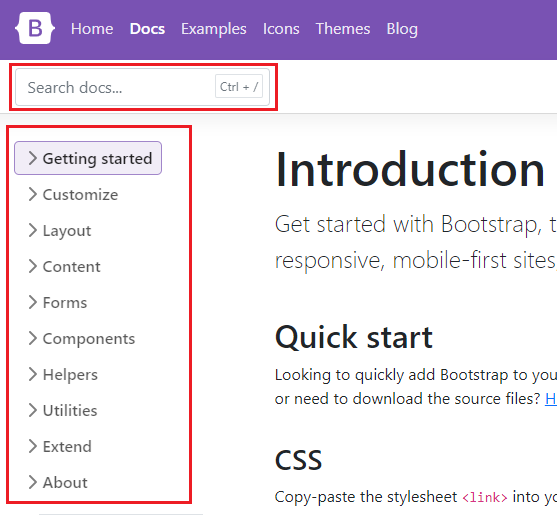
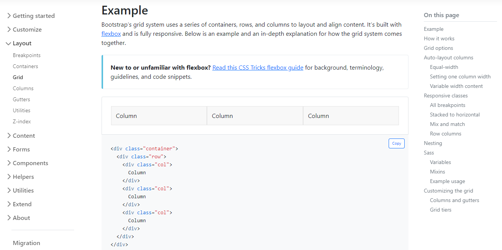
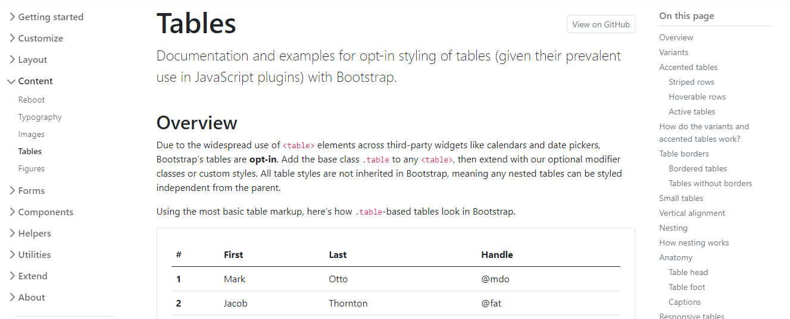
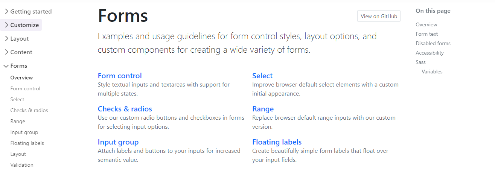
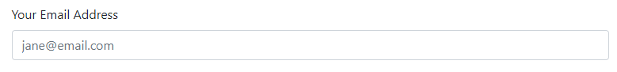
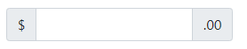
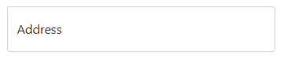
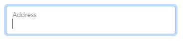
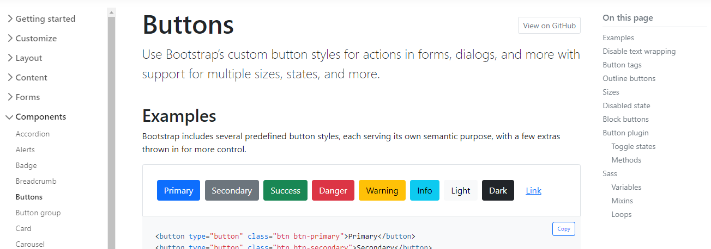

# Bootstrap
Bootstrap is often described as a way to "build fast, responsive sites" and it is a "feature-packed, powerful, and extensible frontend toolkit". 

Some people refer to it as a "front-end" framework, and some are trying to be more specific by referring to it as a "CSS framework" or a “CSS library”. 

So, what is Bootstrap?

Simply put, Bootstrap is a library of CSS and JavaScript code that you can combine to quickly build visually appealing websites.

Modern web development is all about components. Small pieces of reusable code that allow you to build websites quickly. Bootstrap comes with multiple components for very fast construction of multiple components, or parts of components. 

Another important aspect of modern development is responsive grids which allow web pages to adapt their layout and content depending on the device in which they are viewed. Bootstrap comes with a pre-made set of CSS rules for building a responsive grid.

Bootstrap is very popular amongst developers as it saves development time and provides a way for developers to build visually appealing prototypes and websites.

Bootstrap saves significant time because all the CSS code that styles its grid and pre-built components is already written. Instead of having to have a high level of expertise in various CSS concepts, you can just use the existing Bootstrap CSS classes to produce nicely-looking websites. This is indispensable when you need to quickly iterate on website layouts. 

Once you know how Bootstrap works, you’ll have enough knowledge to tweak its styling and a whole new world of development opens up to you.

Since Bootstrap is so popular, understanding how to work with it is a prerequisite in many web development companies. Additionally, you can be safe in knowing that both you and your team members have a common design system and you don't have to spend time deciding how to build one. You are free to jump from team to team, from project to project, even from one company to another, and you don't need to re-learn "their way of doing things".

All of these points make investing time to learn Bootstrap a great way to boost your web development skills. In this lesson, you’ll be introduced to the core concepts of Bootstrap and learn how to build web pages using it.

### Dimensions

| BreakPoint        | Class infix | Dimensions |
|-------------------|-------------|------------|
| Extra small       |             | < 576 px   |
| Small             | sm          | >= 576 px  |
| Medium            | md          | >= 768 px  |
| Large             | lg          | >= 992 px  |
| Extra Large       | xl          | >= 1200 px |
| Extra extra Large | xxl         | >= 1400 px |

Bootstrap comes with detailed documentation on setting up and using the features available in its library. The documentation is clear and has many code examples to help you get started.

In this reading, you'll explore the frequently used documentation sections.

The documentation for Bootstrap is currently available at the following link.

https://getbootstrap.com/docs

### Navigating the documentation
The sidebar on the webpage allows you to navigate through the different sections of the documentation. There is also a search box if you need to search for a specific piece of information.



### Layout
The layout section of the documentation describes how to use the grid system of Bootstrap. This covers what you've learned so far and includes more advanced usage such as offsets, column alignment, auto-layout and variable width columns.



### Content
The content section of the documentation describes Bootstrap's default text styling and how to use responsive images and tables. You've learned the basics of these earlier on and this section goes into further detail.



### Forms
The forms section of the documentation describes how to build forms using Bootstrap's styles. The library has many CSS rules to improve your form's user interface and experience. Below are some features you'll frequently use as a developer:



### Form Styling
Bootstrap includes CSS rules to improve the visual style of input elements.

For example:



This table outlines the different HTML form elements and which Bootstrap CSS class should be used for them.

| **Form Element**        | **CSS class**      |
|-------------------------|--------------------|
| `input`                 | `form-control`     |
| `input type="checkbox"` | `form-check-input` |
| `input type="radio"`    | `form-check-input` |
| `input type="range"`    | `form-range`       |
| `select`                | `form-select`      |

Using these CSS classes will style the elements appropriately for different input types, sizings and states.

### Switches
If you've used an app on your mobile device, you're probably familiar with the switch input type.


Bootstrap includes CSS rules to style checkbox input elements as switches. 

To do this:

1. Add the input to a div element. 
2. On the div element, apply the form-check and form-switch CSS classes. 
3. On the input element, add the form-check-input CSS class.
```html
<div class="form-check form-switch">
  <input class="form-check-input" type="checkbox">
</div>
```
### Input Groups
Input groups are useful for providing additional content to the input field. For example, if you wanted to request the user to input a US dollar amount, you can use an input group to show the dollar symbol and cents amount.



To do this:

1. Add the input to a div element. 
2. Apply the input-group CSS classes on the div element. 
3. Add a span element before and/or after the input element and apply the input-group-text CSS class to it. The text content is then added inside the span element.

```html
<div class="input-group">
  <span class="input-group-text">$</span>
  <input type="text" class="form-control">
  <span class="input-group-text">.00</span>
</div>
```
### Floating Labels





To do this, add the `input` to a `div` element. On the `div` element, apply the `form-floating` CSS classes.
```html
<div class="form-floating">
  <input type="email" class="form-control" id="addressInput" placeholder="Address">
  <label for="addressInput">Address</label>
</div>
```
### Components
As you have learned, Bootstrap comes with many pre-made UI elements and styles to help speed up your development.

Some of these components require Javascript to work, while others only require CSS classes applied to HTML elements. The Components section of the documentation explains these requirements on each component page and provides many code examples.



