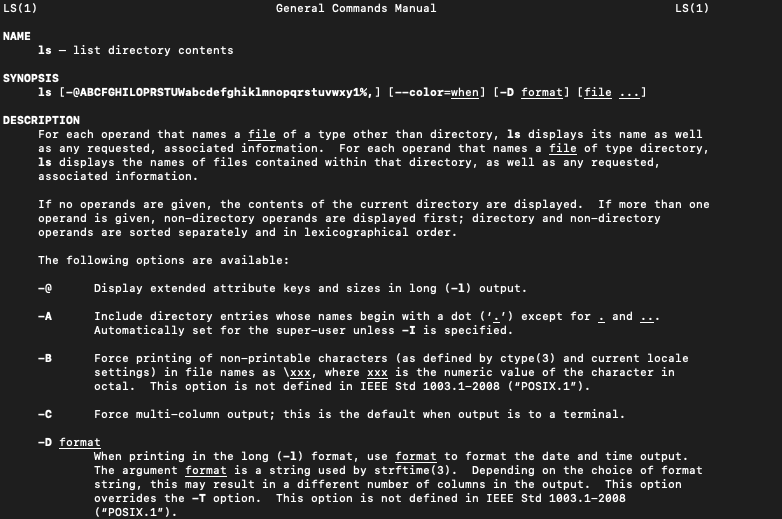

## Using Bash on Mac Terminal

#### Learning Objectives

- Learners will understand how to open the command line - terminal on Mac.

- Learners will become familiar with the most common commands.

#### Mac Terminal
The Terminal on Mac can be opened in one of three ways: Finder, Launch Pad and Spotlight.

#### Bash commands
Bash provides a list of commands for navigating through files, viewing the contents of files, and edit features for changing or updating the contents of a file. Below is a list of the most common commands:

| **Command** | **Used for**                                                                 |
|-------------|------------------------------------------------------------------------------|
| `cd`        | Change Directory                                                             |
| `ls`        | List command used for showing the content of a directory.                    |
| `rm`        | Remove command used for removing a file or a directory                       |
| `mv`        | Used to move files or folders to another location                            |
| `touch`     | Allows creating of a new empty file or to update a timestamp on a file       |
| `cp`        | Used to make a copy of a file or folder                                      |
| `mkdir`     | Make a new directory                                                         |
| `pwd`       | Print work directory, shows the current location in the shell                |
| `cat`       | Allows reading or concatenation of a file                                    |
| `less`      | Displays the contents of a file one page at a time.                          |
| `grep`      | Global regular expression, allows for searching contents of files or folders |


#### Flags
Every bash command has flags for changing the output of the command itself. For example, the ls command prints out the list of contents inside a directory. If we wanted to show the list in a different view, we simply need to add a flag such as **-l**.


When the flag of **-l** is passed, it will show the output differently:


#### Man Pages
When first learning commands from bash, it can feel a bit daunting. Luckily, every command has its manual (or man pages for short). The man page lists all the flags and options that a particular command has to offer. Again, let's use the **ls** command to demonstrate this. Type the following:
```bash
man ls
```


The man pages are a great way to recall the different flags that are available and a great tool in your arsenal to becoming more fluent in bash.

#### Editing
There are many options for editing files in bash. The most common is usually VI or Vim. VI stands for visual editor. It's used for making edits and changes to a file and saving them. It's similar to what you may have used in applications like Word. VIM is a better version of VI with some improvements - hence its name: visual editor improved. Learning the commands in Vim will feel different from GUI applications, but once you practice, it will feel like second nature. Vim uses modes to determine the commands you can work with:

- Normal mode: Default mode

- Insert mode: Allows the contents of the files to be edited.

- Command line mode: Normal commands begin with :


