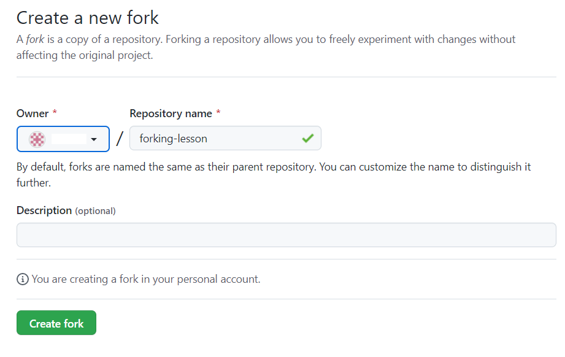
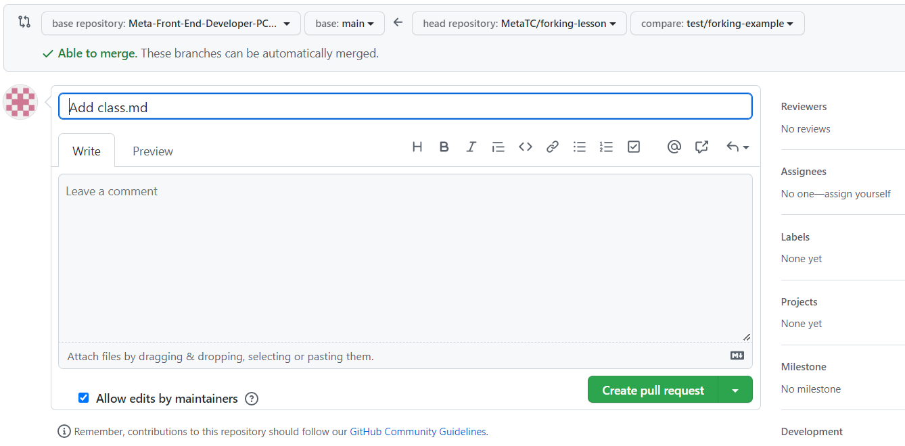

## Resolving conflicts

Conflicts will normally occur when you try to merge a branch that may have competing changes. Git will normally try to automatically merge (auto-merge), but in the case of a conflict, it will need some confirmation. The competing changes need to be resolved by the end user. This process is called merging or rebasing. 

The developer must look at the changes on the server and their local and validate which changes should be resolved.

A merge conflict example is when two developers work on their dependent branches. Both developers are working on the same file called Feature.js. Each of their tasks is to add a new feature to an existing method. Developer 1 has a branch called feature1, and developer 2 has a branch called feature2. 

Developer 1 pushes the code with the changes to the remote repository. Developer 2 pushes their changes.


Let's walk through how this would happen in Git. Both developers 1 and 2 check out the main repository on Monday morning. They both have the same copy. Both developers check out a new branch - feature 1 and 2.

```bash
git pull
git checkout -b feature1
```
```bash
git pull
git checkout -b feature2
```
Developer 1 makes their changes to a file called Feature.js and then commits the changes to the repository for approval via a PR (pull request)
```bash
git add Feature.js
git commit -m 'chore: added feature 1!!'
git pull origin main
git push -u origin feature1
```
The PR is reviewed and then merged into the main branch. Meanwhile, Developer 2 is starting to code on his feature. Again, they go through the same process as Developer 1:
```bash
git add Feature.js
git commit -m 'chore: added feature 2!!!'
git pull origin main

From github.com:demo/demo-repo
 * branch            main       -> FETCH_HEAD
   9012934..d3b3cc0  main       -> origin/main
Auto-merging Feature.js
CONFLICT (content): Merge conflict in Feature.js
Automatic merge failed; fix conflicts and then commit the result.
```
Git lets us know that a merge conflict has occurred and needs to be fixed before it can be pushed to the remote repo. Running git status will also give us the same level of detail:
```bash
    git status
    On branch feature2
You have unmerged paths.
  (fix conflicts and run "git commit")
  (use "git merge --abort" to abort the merge)

Unmerged paths:
  (use "git add <file>..." to mark resolution)
        both modified:   Feature.js

no changes added to commit (use "git add" and/or "git commit -a")
```
In order to merge, Developer 2 needs to see and compare the changes from Developer 1. It is good practice to first see what branch is causing the merge issue. Developer 2 runs the following command:
```bash
 git log --merge

commit 79bca730b68e5045b38b96bec35ad374f44fe4e3 (HEAD -> feature2)
Author: Developer 2 
<developer2@demo.com>
Date:   Sat Jan 29 16:55:40 2022 +0000

    chore: add feature 2

commit 678b0648107b7c53e90682f2eb8103c59f3cb0c0
Author: Developer 1 
<developer1@demo.com>
Date:   Sat Jan 29 16:53:40 2022 +0000

    chore: add feature 1
```
We can see from the above code that the team's conflicting changes occurred in feature 1 and 2 branches. Developer 2 now wants to see the change that is causing the conflict.
```bash
git diff

diff --cc Feature.js
index 1b1136f,c3be92f..0000000
--- a/Feature.js
+++ b/Feature.js
@@@ -1,4 -1,4 +1,8 @@@
  let add = (a, b) => {
++<<<<<<< HEAD
 +  if(a + b > 10) { return 'way too much'}
++=======
+   if(a + b > 10){ return 'too much' }
++>>>>>>> d3b3cc0d9b6b084eef3e0afe111adf9fe612898e
    return a + b;
  }
```
The only difference is the wording in the return statement. Developer 1 added 'too much,' but Developer 2 added 'far too much. Everything else is identical in terms of merging and it's a pretty easy fix. Git will show arrows <<< >>> to signify the changes. Developer 2 removes the markers so the code is ready for submission:

```js
let add = (a, b) => {
  if(a + b > 10) { return 'way too much'}
  return a + b;
}
```
```bash
 git add Feature.js
 git commit -m 'fix merge conflicts'
 git push -u origin feature2
```
Developer 2 has now fixed a merge conflict and can create their PR to get the code merged into the main line.

## Forking

In previous lessons, you have touched on workflows such as branching and how they can be used to simplify a process for a team. Forking is another type of workflow. The key difference between branching and forking is that the workflow for forking creates a new repository entirely. Branching cuts a new branch from the same repository each time and each member of the team works on the single repository.

Let's take a simple example of how forking works. In the diagram below the coolgame repo has been forked by Joe. The entire contents and the history of the repository are now stored in Joe's account on GitHub. Joe is now free to make edits and changes to the repository at his own will. You, the owner of the coolgame repository can continue to work as normal and not know about Joe's edits or changes.


Joe created a new branch on his repository and added a new cool feature that he felt was needed. In order for Joe to get his feature back into the original repository, he will need to create a PR as normal but instead of comparing with the main branch, it needs to be compared with the original repository. Essentially the two repositories are compared against each other. The owner of the original repository can then review the PR and choose to accept of decline the new feature.

#### Forking
Let us take a look at how you can fork an existing repository that is available on GitHub. For this example, we used a repository we can access on GitHub.

**Step 1:** If you have access to your own repository on GitHub, you can access this now to follow along.

**Step 2:** Click on the Fork button on the top right of the page.


**Step 3:** It will then prompt you to fork the repository to your desired account. Choose the account you wish to fork to.




**Step 4:** Github will then clone the repository into your chosen GitHub account.

In a couple of steps, you have successfully forked a repository into our own GitHub account. The full repository is cloned and allows us to work directly in that repository as if it was our own.

On the landing page of the GitHub repository, it will show directly under the repository name that it was forked from Meta-Front-End-Developer-PC/forking-lesson.


Other subtle differences in the GitHub UI on a forked branch is the top information bar above the files.

It now shows that the branch is up to date with forking-lesson:main. It also adds a Fetch upstream drop-down to allow you to pull and merge the latest changes from the original repository.


#### Example
Let's run through a typical flow of creating a new branch and adding some new content.

**Step 1**: Clone the repository.

**Step 2**: Create a new branch.

`git checkout -b test/forking-example`

**Step 4:** Create a new file and commit it to the repository.

`touch text.txt`
`git add . `
`git commit -m 'chore: testing'` 

**Step 5:** Push the branch to your remote repository.

`git push -u origin test/forking-example` 

**Step 6:** Go to Github and click the Compare & pull request button. If it's not available, click on the branch dropdown button and change it from main to the branch name of test/forking-example:


After clicking the Compare & pull request button it will now redirect to the original repository in order to create the PR.



Each repository will have its own guidelines for submitting PRs against them and usually provide a how-to contribute guide. As you can see, in order to get the changes from our forked repository, you need to compare it against the original. This gives a lot of control to the repository owners of the original and they get to decide what makes the cut to be merged in.